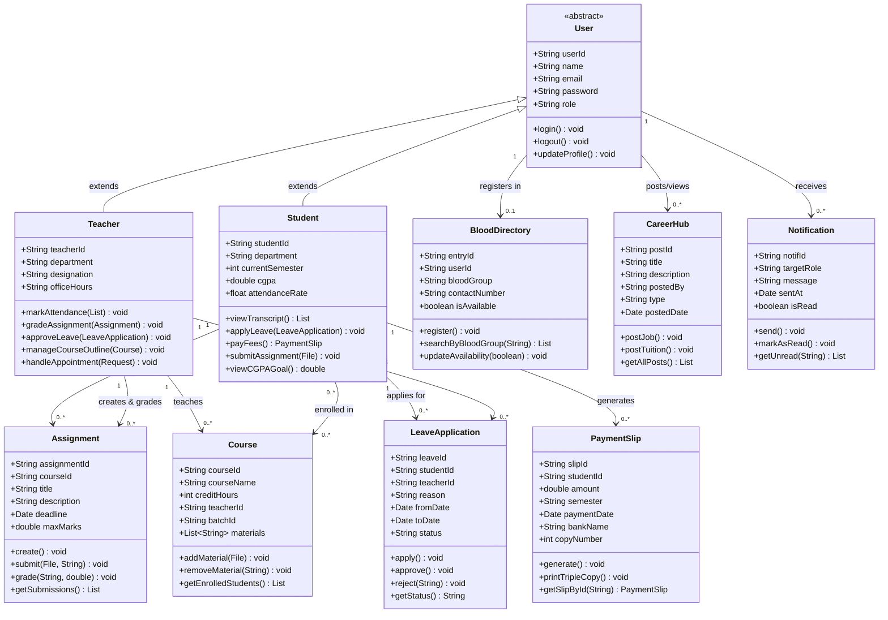

<div align="center">

<!-- ═══════════════════════════════════════════════════════════════ -->
<!--                    ANIMATED WAVE HEADER                        -->
<!-- ═══════════════════════════════════════════════════════════════ -->


<!-- ═══════════════════════════════════════════════════════════════ -->
<!--                   ANIMATED TYPING BANNER                       -->
<!-- ═══════════════════════════════════════════════════════════════ -->

<a href="https://git.io/typing-svg">
  
</a>

<br/>

<!-- ═══════════════════════════════════════════════════════════════ -->
<!--                      TECH BADGES                               -->
<!-- ═══════════════════════════════════════════════════════════════ -->

<p align="center">
  
  
  
  
  
  
  
  
  
</p>

<!-- ═══════════════════════════════════════════════════════════════ -->
<!--                      STATUS BADGES                             -->
<!-- ═══════════════════════════════════════════════════════════════ -->

<p align="center">
  
  
  
  
  
</p>

<br/>

<!-- Animated divider -->


</div>

---

## 🚀 Core Features

Nexus One is divided into dedicated portals, each tailored with specific functionalities:

### 👨‍🎓 Student Portal
* **🧠 Smart Dashboard:** Track live CGPA goals, attendance rate, and urgent notices.
* **📊 Academic Records:** Semester-wise transcript view and performance forecasting.
* **💳 Finance & Fees:** Generate automated, sequential 3-copy payment slips (Trust Bank).
* **🏖️ Leave Applications:** Request leaves and track approval status directly.
* **📝 Assignments & Materials:** Submit assignment files, view course outlines, and track deadlines.

### 👨‍🏫 Teacher Portal
* **📋 Intelligent Attendance:** Real-time session attendance with low-attendance alerts.
* **✅ Assignment Evaluator:** Create, manage, and grade student submissions easily.
* **🤝 Faculty Sync:** Manage office hours and accept/decline student meeting requests.
* **🔐 Leave Management:** Approve or reject student leave applications in one click.
* **📚 Course Outlines:** Upload modules, PDFs, and resources for specific batches.

### ⚙️ Shared Utilities
* **🩸 Blood Finder Directory:** A built-in campus directory to request or donate blood during emergencies.
* **💼 Career & Tuition Hub:** Official job circulars and student tuition vacancy postings.

---

## 🖼️ System Interface Showcase

### 👨‍🎓 Student Portal

| 🔐 Secure Login Portal | 🏠 Dashboard Experience |
| :---: | :---: |
|  |  |
| **👤 My Profile** | **📊 Semester Results** |
|  |  |
| **💳 Finance & Payments** | **🏖️ Leave Application** |
|  |  |
| **📝 My Assignments** | **📚 Course Outlines** |
|  |  |
| **🤝 Faculty Sync** | **💼 Career Hub** |
|  |  |
| **🩸 Blood Finder Directory** | **🔔 Recent Alerts / Notifications** |
|  |  |

### 👨‍🏫 Teacher Portal

| 🏠 Dashboard & Overview | ✅ Mark Attendance |
| :---: | :---: |
|  |  |
| **📝 Manage Assignments** | **🏖️ Approve Leave Requests** |
|  |  |
| **🤝 Faculty Sync (Appointments)** | **💼 Career & Tuition Hub** |
|  |  |
| **🩸 Blood Finder Directory** | **🔔 Notifications / Alerts** |
|  |  |
| **📚 Course Outlines & Materials** | |
|  | |

---

## 🛠️ Tech Stack & Architecture

| 🔧 Layer | 💡 Technology |
|---|---|
| 🖥️ **Backend** | Java 17, Spring Boot, Spring Security |
| 🎨 **Frontend** | HTML5, CSS3, JavaScript, Thymeleaf (SSR) |
| 🗄️ **Database** | Custom Flat-File Storage (`.txt`) via Java File I/O |
| 🔐 **Auth** | Session-based with Role-Based Access Control (RBAC) |
| ⚙️ **Build Tool** | Apache Maven |

---

## 📐 UML Class Diagram



---

## 📁 Folder Structure

```
🗂️ OOPS-II-project/
│
├── 📁 src/
│   ├── 📁 main/
│   │   │
│   │   ├── 📁 java/com/nexusone/
│   │   │   │
│   │   │   ├── 📁 controller/               🎮 MVC Controllers
│   │   │   │   ├── 🟦 AuthController.java
│   │   │   │   ├── 🟦 StudentController.java
│   │   │   │   ├── 🟦 TeacherController.java
│   │   │   │   ├── 🟦 AssignmentController.java
│   │   │   │   ├── 🟦 LeaveController.java
│   │   │   │   ├── 🟦 PaymentController.java
│   │   │   │   ├── 🟦 BloodController.java
│   │   │   │   └── 🟦 CareerController.java
│   │   │   │
│   │   │   ├── 📁 model/                    🗃️ Data Models / Entities
│   │   │   │   ├── 🟩 User.java
│   │   │   │   ├── 🟩 Student.java
│   │   │   │   ├── 🟩 Teacher.java
│   │   │   │   ├── 🟩 Course.java
│   │   │   │   ├── 🟩 Assignment.java
│   │   │   │   ├── 🟩 LeaveApplication.java
│   │   │   │   ├── 🟩 PaymentSlip.java
│   │   │   │   ├── 🟩 BloodDirectory.java
│   │   │   │   ├── 🟩 CareerPost.java
│   │   │   │   └── 🟩 Notification.java
│   │   │   │
│   │   │   ├── 📁 service/                  ⚙️ Business Logic Layer
│   │   │   │   ├── 🟨 StudentService.java
│   │   │   │   ├── 🟨 TeacherService.java
│   │   │   │   ├── 🟨 AssignmentService.java
│   │   │   │   ├── 🟨 LeaveService.java
│   │   │   │   ├── 🟨 PaymentService.java
│   │   │   │   ├── 🟨 BloodService.java
│   │   │   │   ├── 🟨 CareerService.java
│   │   │   │   └── 🟨 NotificationService.java
│   │   │   │
│   │   │   ├── 📁 repository/               💾 File I/O Data Access
│   │   │   │   ├── 🟥 FileRepository.java
│   │   │   │   ├── 🟥 StudentRepository.java
│   │   │   │   ├── 🟥 TeacherRepository.java
│   │   │   │   └── 🟥 CourseRepository.java
│   │   │   │
│   │   │   ├── 📁 security/                 🔐 Auth & RBAC
│   │   │   │   ├── 🔒 SecurityConfig.java
│   │   │   │   └── 🔒 CustomUserDetailsService.java
│   │   │   │
│   │   │   ├── 📁 util/                     🛠️ Utility Helpers
│   │   │   │   ├── 🔧 FileUtil.java
│   │   │   │   └── 🔧 DateUtil.java
│   │   │   │
│   │   │   └── 🚀 NexusOneApplication.java  ← Main Entry Point
│   │   │
│   │   └── 📁 resources/
│   │       │
│   │       ├── 📁 templates/                🎨 Thymeleaf HTML Views
│   │       │   ├── 📁 student/
│   │       │   │   ├── 🌐 dashboard.html
│   │       │   │   ├── 🌐 profile.html
│   │       │   │   ├── 🌐 transcript.html
│   │       │   │   ├── 🌐 payment.html
│   │       │   │   ├── 🌐 leave.html
│   │       │   │   ├── 🌐 assignments.html
│   │       │   │   ├── 🌐 course-outline.html
│   │       │   │   ├── 🌐 faculty-sync.html
│   │       │   │   ├── 🌐 career.html
│   │       │   │   ├── 🌐 blood-finder.html
│   │       │   │   └── 🌐 notifications.html
│   │       │   │
│   │       │   ├── 📁 teacher/
│   │       │   │   ├── 🌐 dashboard.html
│   │       │   │   ├── 🌐 attendance.html
│   │       │   │   ├── 🌐 assignments.html
│   │       │   │   ├── 🌐 leave-approval.html
│   │       │   │   ├── 🌐 faculty-sync.html
│   │       │   │   ├── 🌐 course-outline.html
│   │       │   │   ├── 🌐 career.html
│   │       │   │   ├── 🌐 blood-finder.html
│   │       │   │   └── 🌐 notifications.html
│   │       │   │
│   │       │   ├── 🌐 login.html
│   │       │   └── 🌐 error.html
│   │       │
│   │       ├── 📁 static/                   🎨 Frontend Assets
│   │       │   ├── 📁 css/
│   │       │   │   ├── 🎨 main.css
│   │       │   │   ├── 🎨 student.css
│   │       │   │   └── 🎨 teacher.css
│   │       │   ├── 📁 js/
│   │       │   │   ├── ⚡ main.js
│   │       │   │   └── ⚡ dashboard.js
│   │       │   └── 📁 images/
│   │       │       └── 🖼️ kyau-logo.png
│   │       │
│   │       ├── 📁 data/                     🗄️ Flat-File Database
│   │       │   ├── 📄 students.txt
│   │       │   ├── 📄 teachers.txt
│   │       │   ├── 📄 courses.txt
│   │       │   ├── 📄 assignments.txt
│   │       │   ├── 📄 submissions.txt
│   │       │   ├── 📄 leaves.txt
│   │       │   ├── 📄 payments.txt
│   │       │   ├── 📄 blood_directory.txt
│   │       │   ├── 📄 career_posts.txt
│   │       │   └── 📄 notifications.txt
│   │       │
│   │       └── ⚙️ application.properties
│   │
│   └── 📁 test/
│       └── 📁 java/com/nexusone/
│           └── 🧪 NexusOneApplicationTests.java
│
├── 📁 target/                               🏗️ Build Output (auto-generated)
├── 📜 pom.xml                               📦 Maven Dependencies
└── 📖 README.md                             📋 Project Documentation
```

---

## ⚙️ Getting Started / Installation

**1️⃣ Clone the repository**
```bash
git clone https://github.com/ABIR-DEB120657/OOPS-II-project.git
cd OOPS-II-project
```

**2️⃣ Build with Maven**
```bash
mvn clean install
```

**3️⃣ Run the application**
```bash
mvn spring-boot:run
```

**4️⃣ Open in browser**
```
http://localhost:8080
```

---

<div align="center">

<!-- Animated divider -->


<!-- ═══════════════════════════════════════════════════════════════ -->
<!--                     👥 AUTHORS SECTION                         -->
<!-- ═══════════════════════════════════════════════════════════════ -->

## 👥 Meet the Authors

<p align="center">
  
  
</p>

<br/>

<table>
  <tr>
    <td align="center" width="50%">
      <br/>
      <b>🧑‍💻 ABIR DEB</b><br/>
      <sub>💡 Lead Developer & Architect</sub><br/><br/>
      <a href="https://github.com/ABIR-DEB120657">
        
      </a><br/>
      
    </td>
    <td align="center" width="50%">
      <br/>
      <b>🧑‍💻 IJAJ AHAMED RAFI</b><br/>
      <sub>🎨 Frontend & Feature Developer</sub><br/><br/>
      <a href="https://github.com/Ijaj-Ahmed-Rafi">
        
      </a><br/>
      
    </td>
  </tr>
</table>

<br/>

<!-- ═══════════════════════════════════════════════════════════════ -->
<!--                     🏫 UNIVERSITY BADGE                        -->
<!-- ═══════════════════════════════════════════════════════════════ -->


<br/><br/>

<!-- Star badge -->
<a href="https://github.com/ABIR-DEB120657/OOPS-II-project/stargazers">
  
</a>
<a href="https://github.com/ABIR-DEB120657/OOPS-II-project/network/members">
  
</a>

<br/>

<!-- ═══════════════════════════════════════════════════════════════ -->
<!--                   ANIMATED FOOTER WAVE                         -->
<!-- ═══════════════════════════════════════════════════════════════ -->


</div>
