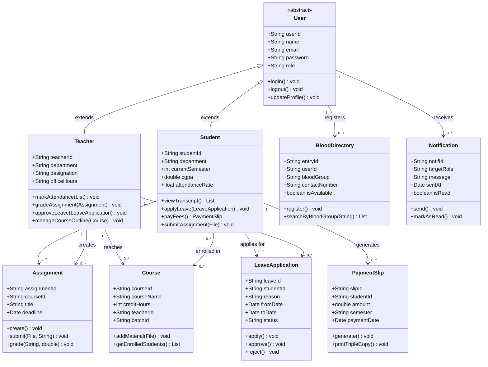

<div align="center">


<br/>

<a href="https://git.io/typing-svg">
  
</a>

<br/><br/>

<p>
  
  
  
  
  
  
  
  
  
</p>

<p>
  
  
  
  
  
</p>

<br/>


</div>

---

## 📖 About The Project

**Nexus One** is a full-stack, role-based **Intelligent University Management System** developed exclusively for **Khwaja Yunus Ali University (KYAU)**. It digitizes and automates the core academic operations of the university — eliminating paper-based processes for attendance, finance, leave applications, assignments, and more.

The platform supports three dedicated portals: **Student**, **Teacher**, and **Admin** — each with a tailored set of features built to simplify everyday university life.

---

## 🚀 Core Features

### 👨‍🎓 Student Portal

| Feature | Description |
|---|---|
| 🧠 Smart Dashboard | Live CGPA tracker, attendance rate, AI-powered alerts and university notices |
| 🎓 Academic Results | Semester-wise transcript, CGPA goal tracker, performance forecast |
| 💳 Finance & Fees | Auto-generate sequential 3-copy payment slips in Trust Bank PLC format |
| 📋 Leave Application | Submit leaves, track status (Pending / Approved / Rejected) |
| 📝 Assignments | Attach and submit files, track deadlines, view approval status |
| 📚 Course Outlines | Access batch-specific PDFs, videos and study materials |
| 🤝 Faculty Sync | Book consultation slots with faculty members |
| 🩸 Blood Finder | Search donors, mark availability, broadcast emergencies |
| 💼 Career Hub | Browse job circulars, tuitions, and apply to opportunities |
| 🔔 Notifications | Real-time alerts for all academic activities |

### 👨‍🏫 Teacher Portal

| Feature | Description |
|---|---|
| ✅ Mark Attendance | Session-based attendance with Course, Batch, Department filters |
| 📝 Assignment Manager | Create, manage and grade student assignment submissions |
| 📋 Leave Approval | Approve or reject student leave applications in one click |
| 🤝 Faculty Sync | Set office hours, accept or decline student meeting requests |
| 📚 Course Outlines | Upload modules, PDFs and resource links for specific batches |
| 💼 Career & Tuition Hub | Post job circulars and review student tuition vacancies |
| 🩸 Blood Finder | View donor directory and broadcast blood emergencies |
| 🔔 Notifications | Manage alerts for assignments, leaves and sync requests |

---

## 🖼️ System Interface Showcase

### 👨‍🎓 Student Portal

| | |
|:---:|:---:|
| **🔐 Secure Login** | **🏠 Dashboard** |
|  |  |
| **👤 My Profile** | **🎓 Semester Results** |
|  |  |
| **💳 Finance & Payments** | **📋 Leave Application** |
|  |  |
| **📝 My Assignments** | **📚 Course Outlines** |
|  |  |
| **🤝 Faculty Sync** | **💼 Career Hub** |
|  |  |
| **🩸 Blood Finder** | **🔔 Notifications** |
|  |  |

### 👨‍🏫 Teacher Portal

| | |
|:---:|:---:|
| **🏠 Dashboard** | **✅ Mark Attendance** |
|  |  |
| **📝 Assignments** | **📋 Leave Requests** |
|  |  |
| **🤝 Faculty Sync** | **💼 Career Hub** |
|  |  |
| **🩸 Blood Finder** | **🔔 Notifications** |
|  |  |
| **📚 Course Outlines** | |
|  | |

---

## 🛠️ Tech Stack

| Layer | Technology |
|---|---|
| Backend | Java 17, Spring Boot, Spring Security |
| Frontend | HTML5, CSS3, JavaScript, Thymeleaf (SSR) |
| Database | Custom Flat-File Storage (.txt) via Java File I/O |
| Auth | Session-based with Role-Based Access Control (RBAC) |
| Email | JavaMail (OTP & Notifications) |
| Build Tool | Apache Maven |

---

## 📐 UML Class Diagram



---

## 📁 Project Structure

```
OOPS-II-project/
├── src/
│   ├── main/
│   │   ├── java/com/nexusone/
│   │   │   ├── controller/
│   │   │   │   ├── AuthController.java
│   │   │   │   ├── StudentController.java
│   │   │   │   ├── TeacherController.java
│   │   │   │   ├── AssignmentController.java
│   │   │   │   ├── LeaveController.java
│   │   │   │   ├── PaymentController.java
│   │   │   │   ├── BloodController.java
│   │   │   │   └── CareerController.java
│   │   │   ├── model/
│   │   │   │   ├── User.java
│   │   │   │   ├── Student.java
│   │   │   │   ├── Teacher.java
│   │   │   │   ├── Course.java
│   │   │   │   ├── Assignment.java
│   │   │   │   ├── LeaveApplication.java
│   │   │   │   ├── PaymentSlip.java
│   │   │   │   ├── BloodDirectory.java
│   │   │   │   └── Notification.java
│   │   │   ├── service/
│   │   │   │   ├── StudentService.java
│   │   │   │   ├── TeacherService.java
│   │   │   │   ├── AssignmentService.java
│   │   │   │   ├── LeaveService.java
│   │   │   │   ├── PaymentService.java
│   │   │   │   ├── BloodService.java
│   │   │   │   └── NotificationService.java
│   │   │   ├── repository/
│   │   │   │   ├── FileRepository.java
│   │   │   │   ├── StudentRepository.java
│   │   │   │   └── TeacherRepository.java
│   │   │   ├── security/
│   │   │   │   ├── SecurityConfig.java
│   │   │   │   └── CustomUserDetailsService.java
│   │   │   ├── util/
│   │   │   │   ├── FileUtil.java
│   │   │   │   └── DateUtil.java
│   │   │   └── NexusOneApplication.java
│   │   └── resources/
│   │       ├── templates/
│   │       │   ├── student/
│   │       │   │   ├── dashboard.html
│   │       │   │   ├── profile.html
│   │       │   │   ├── transcript.html
│   │       │   │   ├── payment.html
│   │       │   │   ├── leave.html
│   │       │   │   ├── assignments.html
│   │       │   │   ├── faculty-sync.html
│   │       │   │   ├── career.html
│   │       │   │   ├── blood-finder.html
│   │       │   │   └── notifications.html
│   │       │   ├── teacher/
│   │       │   │   ├── dashboard.html
│   │       │   │   ├── attendance.html
│   │       │   │   ├── assignments.html
│   │       │   │   ├── leave-approval.html
│   │       │   │   ├── faculty-sync.html
│   │       │   │   ├── career.html
│   │       │   │   ├── blood-finder.html
│   │       │   │   └── notifications.html
│   │       │   ├── login.html
│   │       │   └── error.html
│   │       ├── static/
│   │       │   ├── css/
│   │       │   ├── js/
│   │       │   └── images/
│   │       ├── data/
│   │       │   ├── students.txt
│   │       │   ├── teachers.txt
│   │       │   ├── courses.txt
│   │       │   ├── assignments.txt
│   │       │   ├── leaves.txt
│   │       │   ├── payments.txt
│   │       │   ├── blood_directory.txt
│   │       │   └── notifications.txt
│   │       └── application.properties
│   └── test/
├── pom.xml
└── README.md
```

---

## ⚙️ Getting Started

**1. Clone the repository**
```bash
git clone https://github.com/ABIR-DEB120657/OOPS-II-project.git
cd OOPS-II-project
```

**2. Build with Maven**
```bash
mvn clean install
```

**3. Run the application**
```bash
mvn spring-boot:run
```

**4. Open in browser**
```
http://localhost:8080
```

---

## 🔗 Project Repository

> Check out the full source code, explore modules and feel free to drop a ⭐ if you find it useful!

👉 **[https://github.com/ABIR-DEB120657/OOPS-II-project](https://github.com/ABIR-DEB120657/OOPS-II-project)**

---

<div align="center">


## 👥 Meet the Team

<br/>

<table>
  <tr>
    <td align="center" width="33%">
      <br/><br/>
      <b>Abir Deb</b><br/>
      <sub>Co-Lead & Main Developer</sub><br/>
      <sub>Backend · Full-Stack · Architecture</sub><br/><br/>
      <a href="https://github.com/ABIR-DEB120657">
        
      </a>
    </td>
    <td align="center" width="33%">
      <br/><br/>
      <b>Ijaj Ahamed Rafi</b><br/>
      <sub>Co-Lead & Main Developer</sub><br/>
      <sub>UI/UX · Frontend · Body Design</sub><br/><br/>
      <a href="https://github.com/Ijaj-Ahmed-Rafi">
        
      </a>
    </td>
    <td align="center" width="33%">
      <br/><br/>
      <b>Nibir</b><br/>
      <sub>Contributor & Support</sub><br/>
      <sub>Testing · Assistance</sub><br/><br/>
      
    </td>
  </tr>
</table>

<br/>


<br/><br/>

<a href="https://github.com/ABIR-DEB120657/OOPS-II-project/stargazers">
  
</a>
&nbsp;
<a href="https://github.com/ABIR-DEB120657/OOPS-II-project/network/members">
  
</a>

<br/><br/>


</div>
